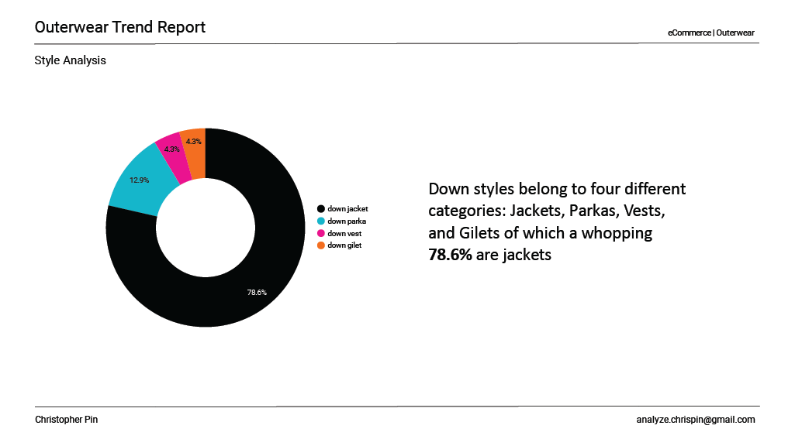
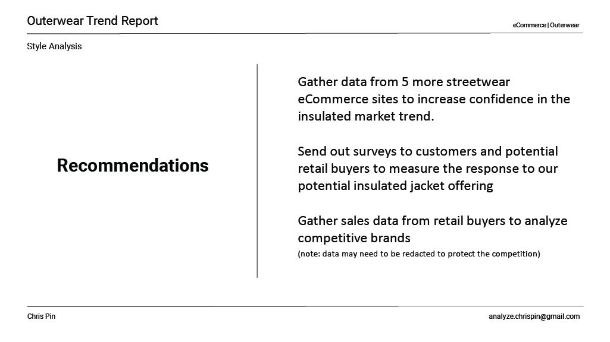

# Data Analyst | Data Visulization

## Technical Skills
#### **Data:** SQL, Looker Studio, BigQuery, Tableau, Google Sheets, Excel
#### **Visulization:** Adobe Illustrator, Adobe Photoshop, Adobe XD, Adobe Creative Cloud

## Education
- Google Data Analytics Certification (2024)
- B.A. Fashion Design & Marketing, IADT (2008)

## Work Experience
**Digital Marketing Analyst @ Haute Hero (2014 - 2023)**
- Social Media Marketing: Analyzed user-generated content and engagement metrics to guide content planning and cross-platform strategies, resulting in 70% increased user engagement and follower growth.
- Digital Marketing: Managed and evaluated performance metrics for Facebook ads, podcast interviews, and YouTube channel interviews, leveraging major media features to enhance brand visibility and reach.
- Brand Collaborations: Partnered with Puma (2022) and Sketchers (2023) to execute successful marketing campaigns and conducted post-campaign analysis to identify key performance indicators.
- D2C eCommerce: Designed and optimized Shopify UI/UX based on user behavior analysis and sales data. Managed sales, fulfillment, and pricing strategies using data insights to improve conversion rates and customer retention.

**Business Intelligence | Data Analyst @ Statmask (2020 - 2023)**
- Oversaw company P&Ls, managing sales and bottom-line targets, product pricing, costs, and market expansion, achieving a 300% year-over-year revenue growth.
- Optimized website UX/UI for improved sales and conversions, aligning brand vision and messaging with user experience and customer flow management, including navigation, site updates, content development, and checkout funnel optimization.
- Developed and executed comprehensive eCommerce strategies, setting KPIs, objectives, and milestones.
- Interpreted D2C Shopify analytics to identify purchasing trends and customer behavior, leveraging sales, customer, and digital marketing data.
- Managed D2C Shopify inventory and conducted inventory forecasting.
- Directed internal teams of 3-5 employees as an experienced hiring manager.
- Developed user-generated content (UGC), including product photography, lookbook images, social media content, editorial content, and newsletter

## Projects

### BERLIN OUTERWEAR MARKET REPORT

#### 1.1 OBJECTIVE
(Google Data Analytics Capstone) Berlin, a premium streetwear fashion brand, wants to expand by offering outerwear pieces in it's collection. However, before launching the new product line, the company's President wants a high-level report analyzing current market trends and competitors. The Director of Marketing and Sales tasked me with performing market research and to create a report that highlights trends, market insights, and key recommendations using data analytics.

#### 1.2 OUTLINE

- 1.3 Data Gathering
- 1.4 Data Cleaning and Manipulation
- 1.5 Visualization
- 1.6 Insights and Recommendations

#### 1.3 DATA GATHERING
I identified five e-commerce boutique stores that align with the Berlin's market positioning in terms of price, product design, target customer, and quality. Using a Chrome browser web crawler extension I scraped over 300 rows of data observations, about 30-70 rows from each website, based on the following variables: brand name, product description, colorway, price, discount, and sale price. Data structures varied from store to store and as a result a unique table was created for each totaling five tables.
 


Using the ```=QUERY()``` function I begin data aggregation, but only after I created matching columns in all five tables: brand_id, description, colorway, sales, and discount columns. Although this method achieved the results I was looking for it was not the most efficient for analysis.  
<br><br>


#### 1.4 DATA CLEANING AND MANIPULATION (SQL)

To prepare the data for analysis, I used BigQuery to join all tables into a single dataset under the ```brand_id``` key_id, and combined product_name with description into one description variable. Finally, I had an aggregated dataset; however, I realized that if I extracted string-specific data from the description column, I could analyze product category frequencies at multiple levels. 
<br><br>
Therefore, I created two more variables: ```style_id``` and ```sub_style_id```. Extracted from description using ```REGEXP_EXTRACT()``` and Common Table Expressions (CTE), the first variable represents broad apparel categories (e.g., jackets, coat, track, vest, etc.), and the second variable identifies specific properties such as materials or functions (e.g., down, shell, windstop, etc.). See SQL query below.
<br><br>
```
WITH descrip_tbl AS -- replace decription_id CTE
(SELECT
  brand_id,
  product_name,
  REPLACE(product_name, 'Jkt', 'Jacket') AS description_id,
  
FROM data-analytics-course-413120.gda_course_8_data.outerwear_tbl
GROUP BY brand_id, product_name
),

style_tbl AS  -- Style_id CTE
(SELECT
  brand_id,
  product_name,
  REGEXP_EXTRACT(
    description_id,
    r'Jacket|Vest|Parka|Coat|Fleece|Anorak|Overcoat|
      Peacoat|Gilet|Track Top|Sweatshirt|Shacket|Overshirt'
  ) AS style_id
  FROM descrip_tbl
  GROUP BY brand_id, product_name, description_id

),
sub_style_tbl AS -- Sub_style_id CTE
(SELECT
  brand_id,
  product_name,
  REGEXP_EXTRACT(
    product_name,
    r'Padded|Down|Linner|Puffer|Bomber|Varsity|Hoodie|Flight|Coach|
    Fleece|Shirt|Track|Packable|Nylon|Chore|Shell|Zip|Ripstop|GORE-TEX|
    Packable|Windrunner|Shearling|Quilted|Wool|Twill|Corduroy|Canvas|
    Flannel|WIP|Denim|Windbreaker|Primaloft®|Cotton|Hoodied|Leather'
  ) AS sub_style_id

FROM data-analytics-course-413120.gda_course_8_data.outerwear_tbl
GROUP BY brand_id, product_name
)

SELECT 
  berlin_ds.brand_id,
  descrip_tbl.description_id,
  style_tbl.style_id,
  sub_style_tbl.sub_style_id,
  berlin_ds.price
  
FROM 
  data-analytics-course-413120.gda_course_8_data.outerwear_tbl AS berlin_ds 
  FULL OUTER JOIN descrip_tbl ON berlin_ds.product_name = descrip_tbl.product_name
  FULL OUTER JOIN style_tbl ON descrip_tbl.product_name = style_tbl.product_name
  FULL OUTER JOIN sub_style_tbl ON style_tbl.product_name = sub_style_tbl.product_name


GROUP BY brand_id,description_id, style_id, sub_style_tbl.sub_style_id, price
ORDER BY price DESC
```
#### 1.5 TABLE CLEANED AND READY FOR ANALYSIS
Lorem ipsum dolor sit amet, consectetur adipiscing elit. Curabitur vel varius ex, id vulputate urna. Quisque fringilla ante sit amet orci suscipit, a tincidunt est vestibulum. Sed sed eros a nisl sollicitudin commodo. Nam volutpat interdum purus, at pellentesque dolor. Lorem ipsum dolor sit amet, consectetur adipiscing elit.
<br><br>


#### 1.6 NULL VALUES
Lorem ipsum dolor sit amet, consectetur adipiscing elit. Curabitur vel varius ex, id vulputate urna. Quisque fringilla ante sit amet orci suscipit, a tincidunt est vestibulum. Sed sed eros a nisl sollicitudin commodo. Nam volutpat interdum purus, at pellentesque dolor. Lorem ipsum dolor sit amet, consectetur adipiscing elit.


#### 1.7 VISUALIZATION
Lorem ipsum dolor sit amet, consectetur adipiscing elit. Curabitur vel varius ex, id vulputate urna. Quisque fringilla ante sit amet orci suscipit, a tincidunt est vestibulum. Sed sed eros a nisl sollicitudin commodo. Nam volutpat interdum purus, at pellentesque dolor. Lorem ipsum dolor sit amet, consectetur adipiscing elit.








