# Data Analyst & Data Visualization

## Work Summary
***
Certified Google Data Analyst with over 15 years of combined experience in fashion design, eCommerce, digital marketing, and data analysis. My unique background allows me to help lifestyle brands identify key business insights, uncover market trends, and grow sales by leveraging tools such as SQL, Python, and BigQuery. My analytics performance includes a 25% year-over-year increase in direct-to-consumer (D2C) sales; a 150% increase in product manufacturing performance; a 20% year-over-year growth in social media followers; and over 8 million combined content views across multiple platforms (YouTube, Instagram, and Facebook).

## Technical Skills
***
#### SQL, Python, Looker Studio, BigQuery, Tableau, Google Sheets, Excel, Adobe Illustrator, Adobe Photoshop, Adobe XD, Adobe Creative Cloud

## Education
***
- IBM Python for Data Science, AI Development Certification, Coursera (2024)
- Google Data Analytics Certification, Coursera (2024)
- B.A. Fashion Design & Marketing, IADT (2008)

## Work Experience
***
**Digital Marketing Analyst @ Haute Hero (2014 - 2023)**
- User-generated content and engagement analysis resulting in 30% YoY increased user engagement and 20% YoY follower growth (2015-2022)
- Digital marketing content strategy and implementation; optimization of facebook ads and instagram organic reach achieving a Socialblade.com score of B+ (2018-2022)
- Social media brand collaborations w/ Puma (150k + views), Business Insider (3 million + views), Galieo (16 million + views EU), Hypebeast (48k views), and Sketchers (2023).
- Increased D2C Shopify conversion rates by 15% YoY through UI/UX optimization, user behavior analytics, and sales analysis.

**Data Analyst | Business Intelligence @ Statmask (2020 - 2023)**
- Market trend research leading to a 25% YoY increase in D2C sales by targeting key ad platforms and influencer channels. Web crawling for first party data collection, google sheets/bigQuery/SQL for data cleaning and Looker Studio for KIP reporting.
- Geolocation dashboard using first party shopify sales data to optimize influencer collaborations and ad targeting. 
- Achieved a 150% boost in manufacturing efficiency by analyzing CNC and sewing machine data by identifying production bottlenecks using custom analytical models. 
- Developed a competitive research dashboard analyzing government contracts using secondary federal contracting data helping to identify local and national competitors ranked by yearly revenue, location, and product type (NAICS Codes). 

## Projects
***
### 1.0 DASHBOARDS: Statmask LLC

#### 1.1 ABOUT
Statmask, LLC is a Brooklyn-based manufacturer of facemasks founded in response to the COVID-19 pandemic. To effectively compete in the marketplace, the company focused on leveraging daily, weekly, and monthly data insights to make strategic decisions in the constantly changing business environment. Below are a few of the dashboards used to support the decision-making process.

#### 1.2 GEO LOCATION DASHBOARD
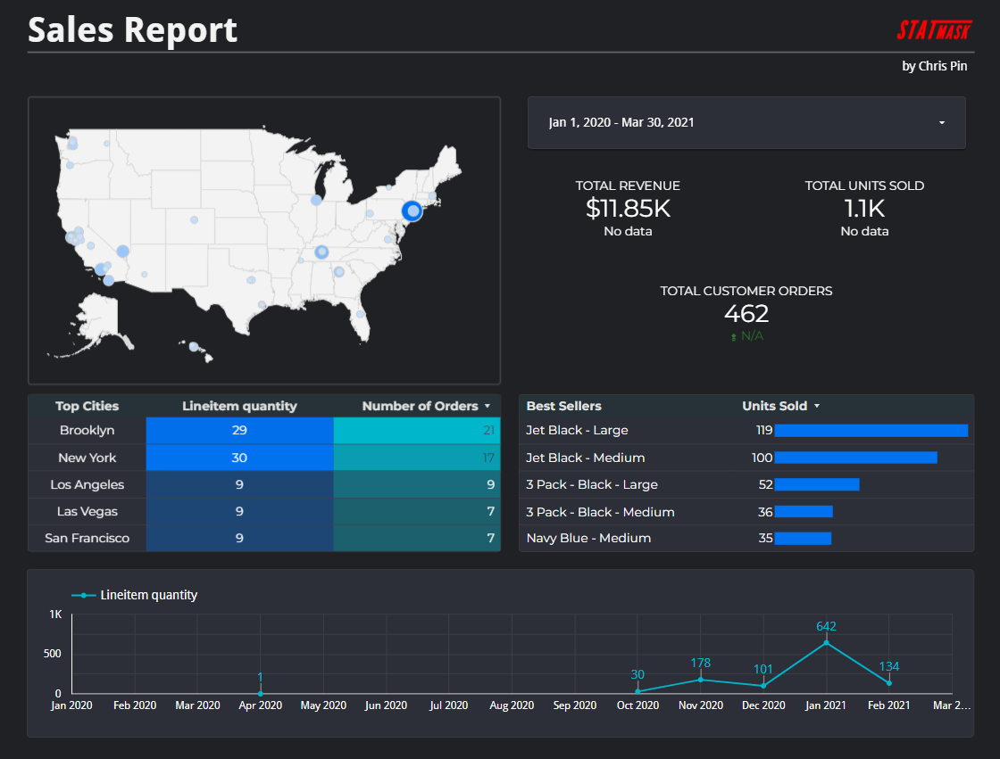
<br><br>
To better understand customer behavior, I created a dashboard using customer location data (state, city, zip code) to help us identify key market regions. By analyzing our Shopify transaction data using a geo-location map, we learned that most of our customers were from the East and West coasts of the United States. As a result, we were able to maximize our marketing budget by focusing our efforts in those regions.

#### 1.3 INCOME AND EXPENSE KPI DASHBOARD
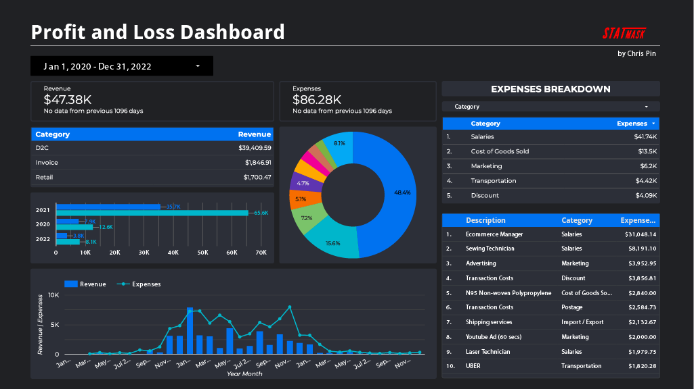
<br><br>
Statmask was founded as a bootstrapped startup with minimal capital, which meant we needed to generate sales as quickly as possible. However, standard accounting applications such as QuickBooks were not helpful in tracking our cash flow performance, not to mention the monthly cost. Instead, I opted to create a custom Looker Studio dashboard that pulled data from an aggregated income and expense Google Sheet, which was updated weekly. As a result, we were able to track the company's income (on the left) and expenses (on the right) with more accuracy and timeliness compared to Quickbooks. 

#### 1.4 COMPETITIVE RESEARCH
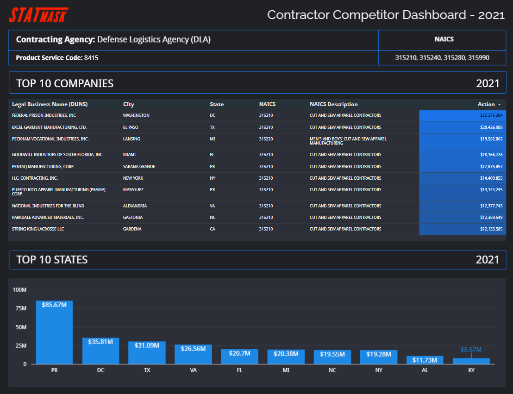
<br><br>
As the market for face masks began to saturate with cheaper imported brands, Statmask started looking to pivot towards government contracting. Given the company's equipment, infrastructure, and apparel manufacturing expertise, I was tasked with researching potential competitors. I gathered first-party federal contractor data from multiple sources, aggregated the data, and finally developed the above dashboard, helping the company quickly understand the apparel contracting landscape by state, city, and action (i.e., revenue). 

***

### 2.0 MARKET REPORT: Outerwear Trend Analysis
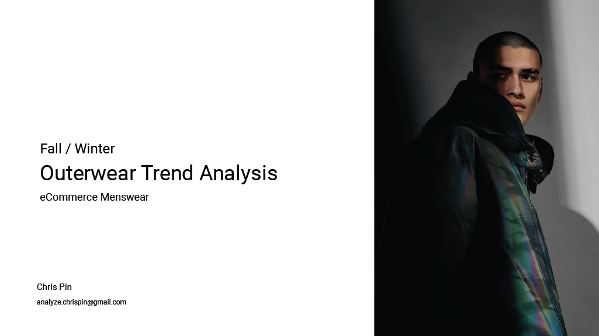
#### 2.1 ABOUT
Google Data Analytics Capstone: Berlin, a premium streetwear fashion brand, wants to expand by offering outerwear pieces in its collection. However, before launching the new product line, the company's President wants a high-level report analyzing current market trends and competitors. The Director of Marketing and Sales tasked me with performing market research and creating a report that highlights trends, market insights, and key recommendations using data analytics.

#### 2.2 OUTLINE
- 2.3 Data Gathering
- 2.4 Data Cleaning and Manipulation w/ SQL
- 2.5 Data Analysis
- 2.6 Null Values
- 2.7 Visualization
- 2.8 Report Preview

#### 2.3 DATA GATHERING
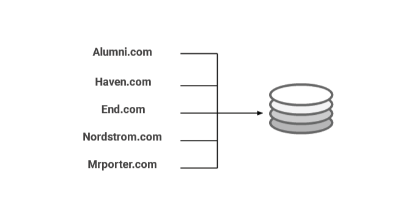
<br><br>
I identified five e-commerce boutique stores that align with Berlin's market positioning in terms of price, product design, target customer, and quality. Using a Chrome browser web crawler extension, I scraped over 300 rows of data observations, about 30-70 rows from each website, based on the following variables: brand name, product description, colorway, price, discount, and sale price. Data structures varied from store to store, and as a result, a unique table was created for each, totaling five tables.
<br><br>
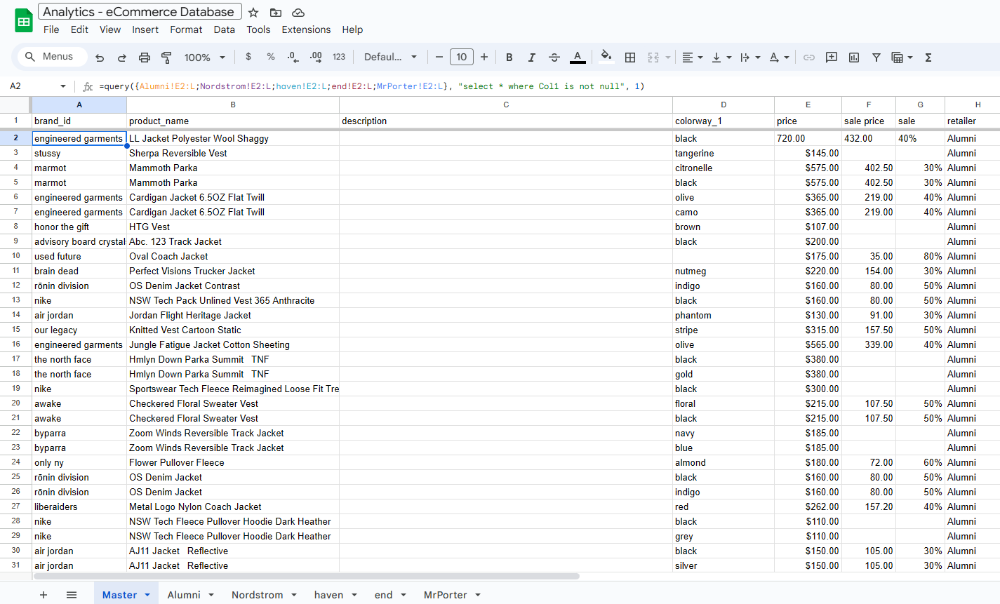
<br><br>
After creating matching columns in all five tables: ```brand_id```, ```description```, ```colorway```, ```sales```, and ```discount``` in google sheets, I was able to aggregate the data using the ```=QUERY()``` function, however this method achieved only surface level organization. As a result I would need to use bigQuery/SQL to properly clean and analyze the data.
<br><br>


#### 2.4 DATA CLEANING AND MANIPULATION w/ SQL

To prepare the data for analysis, I used BigQuery to join all tables into a single dataset under the ```brand_id``` key. I combined ```product_name``` with ```description``` into one description variable, resulting in a cleaned and aggregated dataset. However, to analyze product category frequencies, I needed to extract string-specific data from the description column. Therefore, I created two variables: ```style_id``` and ```sub_style_id```, and extracted them from ```description``` using ```REGEXP_EXTRACT()``` and Common Table Expressions (CTE) for aggregation. The first variable represented broad apparel categories such as jackets, coats, tracks, vests, etc., while the second variable identified specific properties such as materials or functions (e.g., down, shell, windstop, etc.). See the SQL query below.
<br><br>
```
WITH descrip_tbl AS -- replace decription_id CTE
(SELECT
  brand_id,
  product_name,
  REPLACE(product_name, 'Jkt', 'Jacket') AS description_id,
  
FROM data-analytics-course-413120.gda_course_8_data.outerwear_tbl
GROUP BY brand_id, product_name
),
style_tbl AS  -- Style_id CTE
(SELECT
  brand_id,
  product_name,
    REGEXP_EXTRACT(
    description_id,
    r'Jacket|Vest|Parka|Coat|Fleece|Anorak|Overcoat|
      Peacoat|Gilet|Track Top|Sweatshirt|Shacket|Overshirt'
  ) AS style_id
  FROM descrip_tbl
  GROUP BY brand_id, product_name, description_id
),
sub_style_tbl AS -- Sub_style_id CTE`
(SELECT
  brand_id,
  product_name,
    REGEXP_EXTRACT(
    product_name,
    r'Padded|Down|Linner|Puffer|Bomber|Varsity|Hoodie|Flight|Coach|
    Fleece|Shirt|Track|Packable|Nylon|Chore|Shell|Zip|Ripstop|GORE-TEX|
    Packable|Windrunner|Shearling|Quilted|Wool|Twill|Corduroy|Canvas|
    Flannel|WIP|Denim|Windbreaker|Primaloft®|Cotton|Hoodied|Leather'
  ) AS sub_style_id

FROM data-analytics-course-413120.gda_course_8_data.outerwear_tbl
GROUP BY brand_id, product_name
)
SELECT 
  berlin_ds.brand_id,
  descrip_tbl.description_id,
  style_tbl.style_id,
  sub_style_tbl.sub_style_id,
  berlin_ds.price  
FROM 
  data-analytics-course-413120.gda_course_8_data.outerwear_tbl AS berlin_ds 
  FULL OUTER JOIN descrip_tbl ON berlin_ds.product_name = descrip_tbl.product_name
  FULL OUTER JOIN style_tbl ON descrip_tbl.product_name = style_tbl.product_name
  FULL OUTER JOIN sub_style_tbl ON style_tbl.product_name = sub_style_tbl.product_name

GROUP BY brand_id,description_id, style_id, sub_style_tbl.sub_style_id, price
ORDER BY price DESC
```
#### 2.5 DATA ANALYSIS
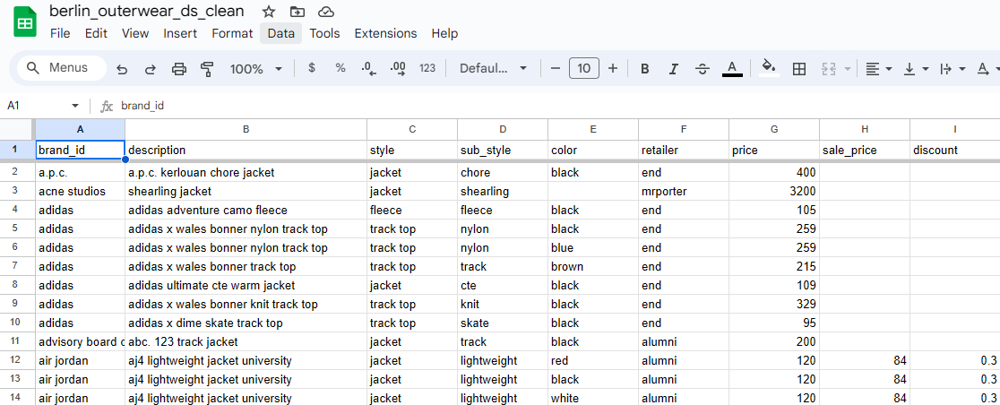
<br><br>
Below is the final dataset after the description variable was aggregated and the string data for ```style_id``` and ```sub_style_id``` were extracted. The dataset is now ready for analysis.
<br><br>

#### 2.6 NULL VALUES
The majority of the nulls values in the dataset were in the ```sale_price``` and ```discount``` columns, both of which were not used in the following report.

#### 2.7 VISUALIZATION
In conclusion, I gathered first-party data from potential competitors to create the dataset, cleaned and manipulated the dataset using Google Sheets and BigQuery/SQL, created two new variables for frequency analysis, and visualized the data using Looker Studio in a comprehensive market report. Below is the completed report with key insights and recommendations. [Click here to view full report](https://lookerstudio.google.com/reporting/b7b2a1d2-341f-4405-9743-5b4390291fa3)
<br><br>
#### 2.8 REPORT PREVIEW
<br><br>
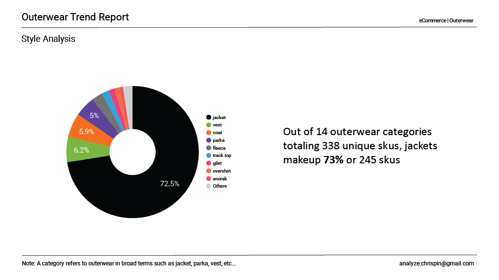
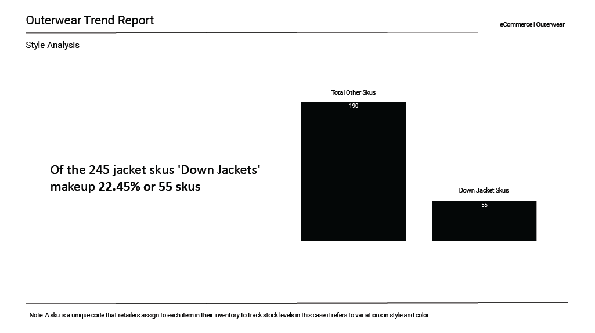
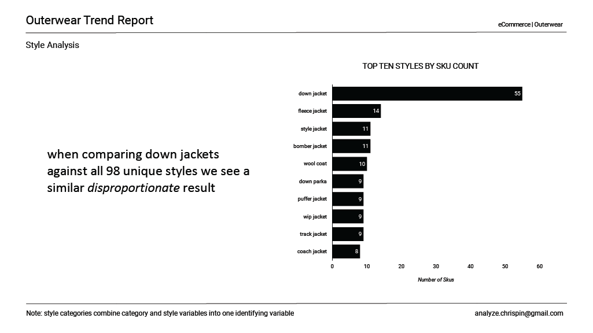
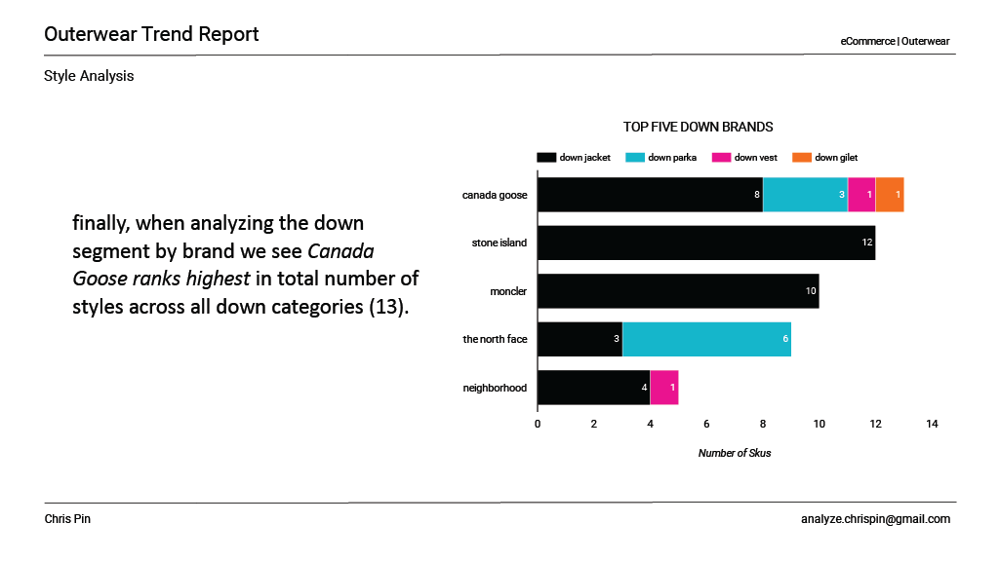
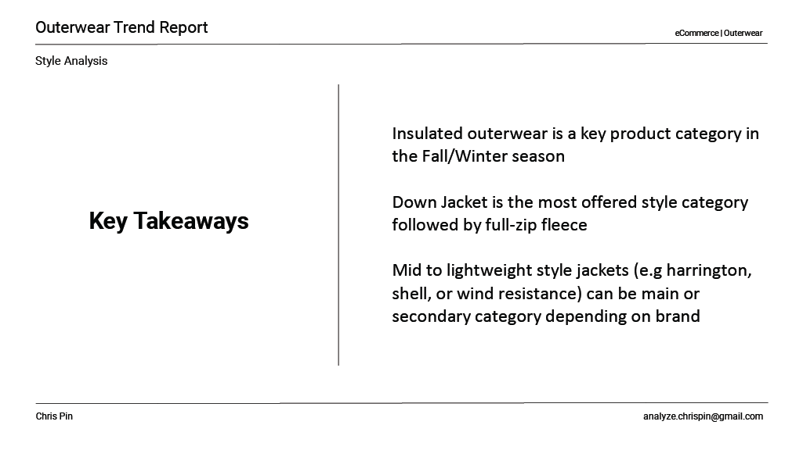


