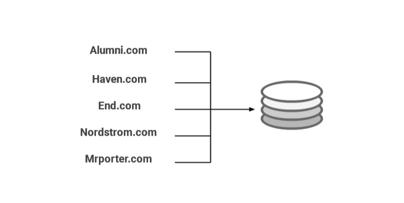
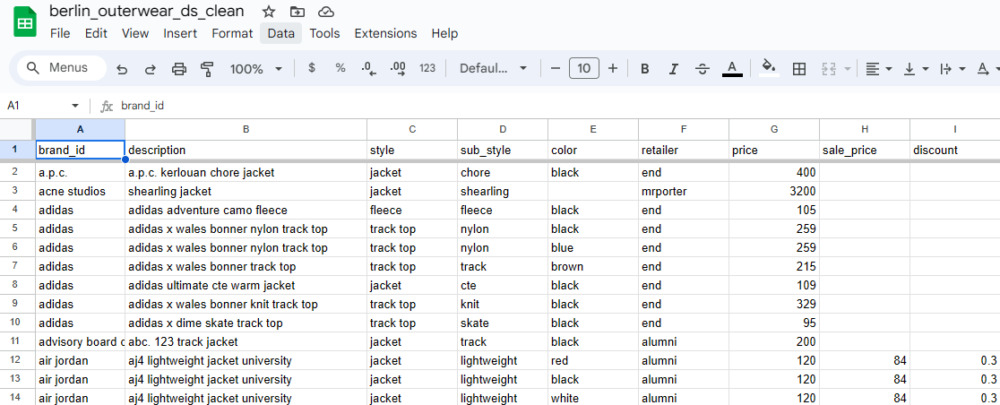
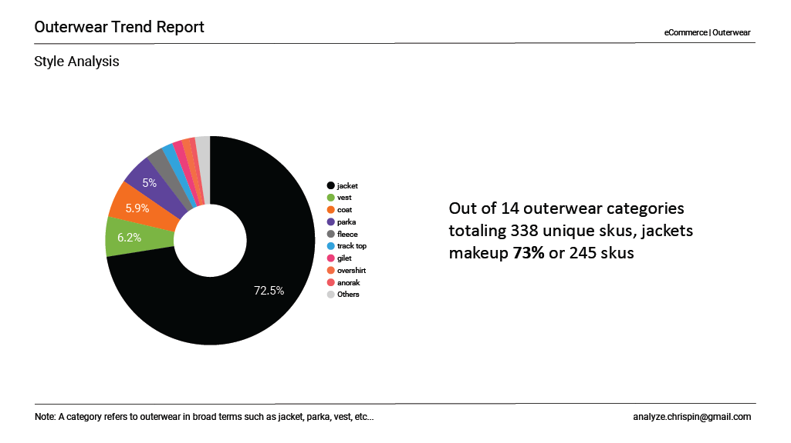
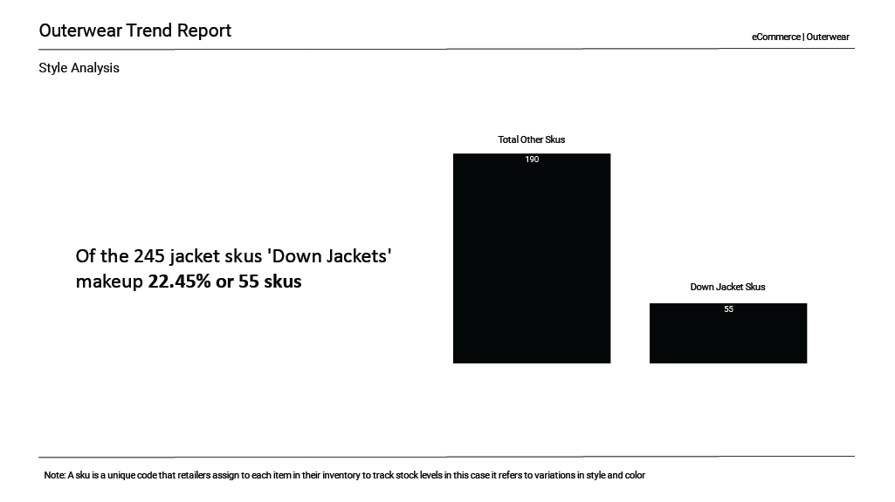
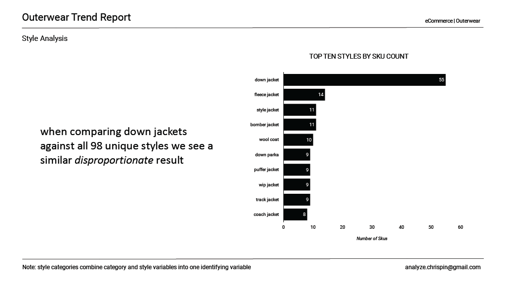
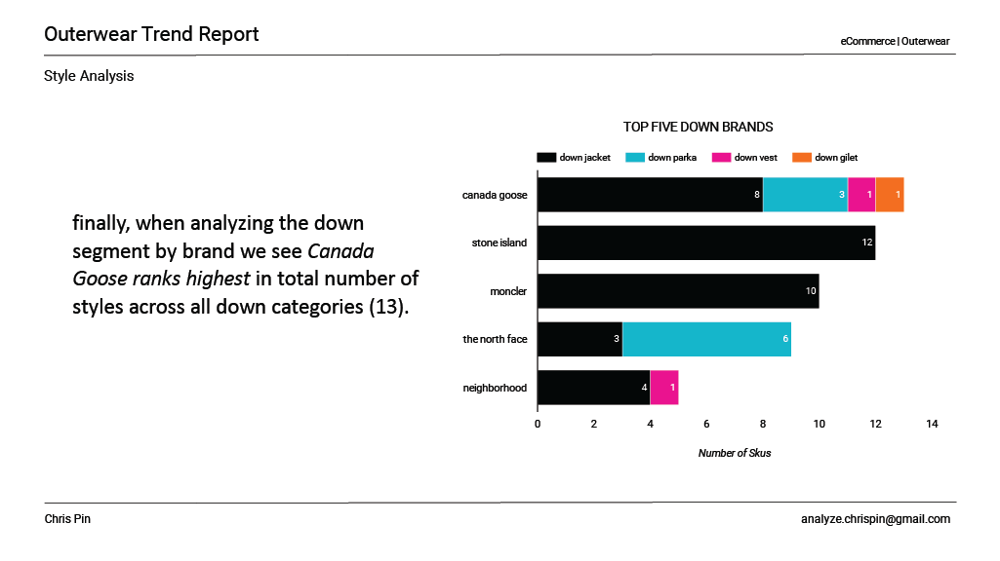
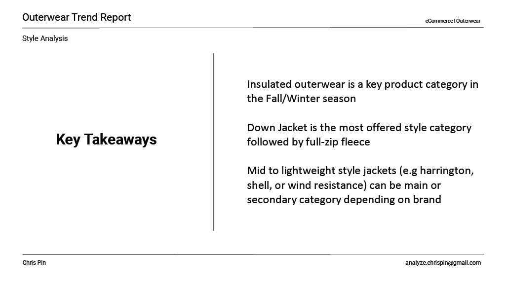

# Data Analyst & Data Visualization

## Work Summary
***
Certified Google Data Analyst with over 15 years of combined experience in fashion design, eCommerce, and digital marketing. My unique background allows me to help lifestyle brands identify key business insights, uncover market trends, and grow sales by leveraging tools such as SQL, Python, and BigQuery. My analytics performance includes a 25% year-over-year increase in direct-to-consumer (D2C) sales; a 150% increase in product manufacturing performance; a 20% year-over-year growth in social media followers; and over 8 million combined content views across multiple platforms (YouTube, Instagram, and Facebook).

## Projects
***
### 2.0 OUTERWEAR TREND REPORT

#### 2.1 ABOUT
Berlin, a premium fashion brand, wants to expand by offering outerwear pieces in its collection. However, before launching the new product line, the company's President wants a high-level report analyzing current market trends and competitors. The Director of Marketing and Sales tasked me with performing market research and creating a report that highlights trends, market insights, and key recommendations using data analytics.

#### 2.3 DATA STRUCTURES

<br><br>
I identified five e-commerce boutique stores that align with Berlin's market positioning in terms of price, product design, target customer, and quality. Using a Chrome browser web crawler extension, I scraped over 300 rows of data observations, about 30-70 rows from each website, based on the following variables: brand name, product description, colorway, price, discount, and sale price. Data structures varied from store to store, and as a result, a unique table was created for each, totaling five tables.
<br><br>

#### 2.4 KPI DASHBOARD OVERVIEW
Lorem ipsum dolor sit amet, consectetur adipiscing elit. In porta nec dui vitae fringilla. Sed tempor fringilla purus sit amet mattis. Etiam sollicitudin facilisis sodales. Nulla facilisi. Quisque quis volutpat risus. Ut nec fringilla tellus, non eleifend ante. Aliquam faucibus mattis ligula a pellentesque. Nulla eleifend sodales porttitor. Phasellus pellentesque tincidunt pulvinar.

#### 2.5 DATA ANALYSIS

<br><br>
Below is the final dataset after the description variable was aggregated and the string data for ```style_id``` and ```sub_style_id``` were extracted. The dataset is now ready for analysis.
<br><br>

#### 2.6 NULL VALUES
The majority of the nulls values in the dataset were in the ```sale_price``` and ```discount``` columns, both of which were not used in the following report.

#### 2.7 VISUALIZATION
In conclusion, I gathered first-party data from potential competitors to create the dataset, cleaned and manipulated the dataset using Google Sheets and BigQuery/SQL, created two new variables for frequency analysis, and visualized the data using Looker Studio in a comprehensive market report. Below is the completed report with key insights and recommendations. [Click here to view full report](https://lookerstudio.google.com/reporting/b7b2a1d2-341f-4405-9743-5b4390291fa3)
<br><br>
#### 2.8 REPORT PREVIEW
<br><br>







